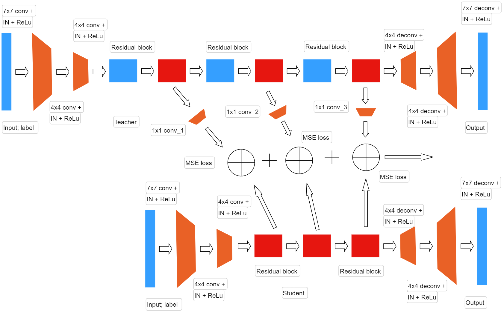
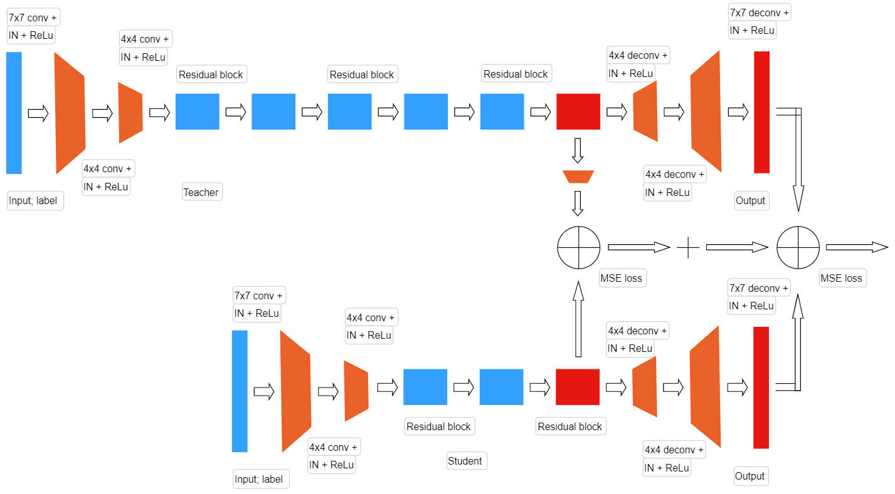
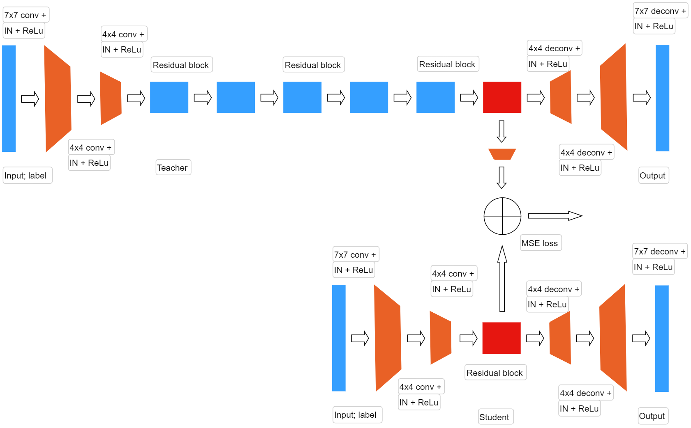

This repository provides some codes of my own research project for my master degree(2022):

In this thesis machine learning techniques will be used to train smaller neural networks using the knowledge of larger neural networks, whose goal is the creation of images.

In machine learning, Knowledge Distillation is the process of transferring knowledge from a large model to a smaller one. Although large models (such as very deep neural networks or ensembles of many models) have a greater capacity for understanding than small models, this capacity may not be fully utilized. Computationally, it can be just as costly to evaluate a model even if it uses little of its knowledge capacity. Knowledge distillation transfers knowledge from a large model to a smaller model, without loss of validity. Because smaller models are less expensive to evaluate, they can be implemented on less powerful hardware (such as a mobile device).

Image-to-Image Translation is a class of visual and graphical problems in which the goal is to learn the mapping between an input image and an output image. It can be applied to a wide range of applications, such as transferring collection styles, transfiguring objects, transferring seasons, and enhancing photos.

The central idea of this thesis is the use of Knowledge Distillation, through the calculation of the Euclidean distance, to train models based on StarGAN whose purpose is to solve the problem of Image-to-Image Translation on compressed models. Knowledge Distillation will be applied in different ways, between the trained generator of the uncompressed network and the generator of the compressed network being trained, between the trained discriminator of the uncompressed network and the discriminator of the compressed network being trained, or will be applied to both generators and discriminators. There will be different types of compression of the models based on Star-GAN and we will evaluate different types of performance, making a summary picture with the performance of the original models, combining multiple Image-to-Image Translation problems.

There's some pics of my idea:

Also I tried to put my CGANs into an android app, so there's some code about pytorch light :D

The main code of the app is in another repo.